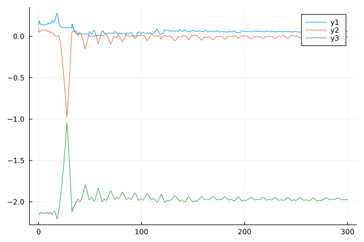

# Lyapunov Epxponent

[Lyapunov exponent](https://en.wikipedia.org/wiki/Lyapunov_exponent) is a quantity we can use to determine the property of a fractional order systems. In  FractionalSystems.jl, we provide performant and easy-to-use API to compute the Lyapunov exponent of the given fractional order system.


Let's see, if given a Rabinovich-Fabrikant system:

```math
D^{\alpha_1} x=y(z-1+z^2)+\gamma x\\
D^{\alpha_2} y=x(3z+1-x^2)+\gamma y\\
D^{\alpha_3} z=-2z(\alpha+xy)
```

```julia
using FractionalSystems

function RF(du, u, t)
    du[1] = u[2]*(u[3]-1+u[1]*u[1])+0.1*u[1];
    du[2] = u[1]*(3*u[3]+1-u[1]*u[1])+0.1*u[2];
    du[3] = -2*u[3]*(0.98+u[1]*u[2]);
end
LE, tspan = FOLyapunov(RF, 0.98, 0, 0.02, 300, [0.1; 0.1; 0.1], 0.005, 1000)
```

The output would be:

```julia-repl
[0.24348568050729053; 0.007633838815648884; -2.01869669467999]
[0.07157300142223447; 0.006017955472054196; -1.8449594097070114]
[0.02954807020615554; 0.005293698652556152; -1.8022533152602607]
[0.052957613549810205; -0.008645340965388692; -1.811729795783463]
[0.012973090534610711; -0.007161228086636709; -1.7732510305991271]
[0.031221399670846705; 0.014443534887429972; -1.813104301211669]
[0.060185947864662345; -0.008121864429315997; -1.8194985262036134]
[0.05827747678224907; -0.02236380502528364; -1.8033534921771472]
[0.05562485202522532; 0.012690387635387365; -1.8357552036479894]
[0.04968563412570279; -0.0009995900467388353; -1.8161301570507935]
[0.07100223089628108; 0.0019123252012412822; -1.8403598219695858]
[0.06326817286599998; -0.019433471090304896; -1.8112809983953584]
[0.06705094763635554; -0.0015939955503458177; -1.8329059006298087]
[0.059724759994251635; -0.0031386869537530426; -1.8240358860199872]
[0.06111650166568285; 0.0038981396237095034; -1.8324646820425692]
```

The computed **LE** is the Lyapunov exponent of this system.

```julia-repl
julia> LE[end-2:end]
3×1 Matrix{Float64}:
  0.06111650166568285
  0.0038981396237095034
 -1.8324646820425692
```

To visualize the Lyapunov exponent, what just need to plot our ```LE```:

```julia
plot(tspan, LE[1, :])
plot!(tspan, LE[2, :])
plot!(tspan, LE[3, :])
```



## Another 4-D example:

Let's see the Piece-Wise Continuous (PWC) fractional order system:

```math
D^{q} x_1=-x_1+x_2\\
D^{q} x_2=-x_3\text{sgn}(x_1)+x_4\\
D^{q} x_3=|x_1|-a\\
D^{q} x_4=-bx_2
```

By following what we have done before, we can easily get the Lyapunov exponent of this PWC system.

```julia
using FractionalSystems, Plots

function Danca(du, u, t)
    du[1] = -u[1]+u[2]
    du[2] = -u[3]*sign(u[1])+u[4]
    du[3] = abs(u[1])-1
    du[4] = -0.5*u[2]
end

LE, tspan=FOLyapunov(Danca, 0.98, 0, 0.02, 300, [0.1; 0.1; 0.1; 0.1], 0.005, 1000)

plot(tspan, LE[1, :])
plot!(tspan, LE[2, :])
plot!(tspan, LE[3, :])
plot!(tspan, LE[4, :])
```

By plot the Lyapunov exponent spectrum:

